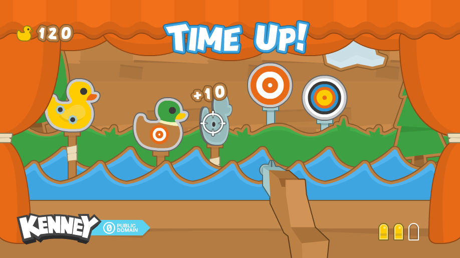

# rust-2d-shooting-gallery
A basic shooting gallery built in Rust

# 

## Description
Using Bevy, a game engine for Rust, I developed a shooting gallery to demonstrate 2d games with multiple layers of depth.

## Version
See [Cargo.toml](Cargo.toml) version

## Platforms / Technologies
* [Rust](https://www.rust-lang.org/en-US/)
* [Cargo](https://doc.rust-lang.org/cargo/)
* [Bevy](https://bevyengine.org/)

## Run
>      $ cargo run

## Build For Release
>      $ cargo build --release

Based on assets from [kenney.nl](https://kenney.nl/):
# 